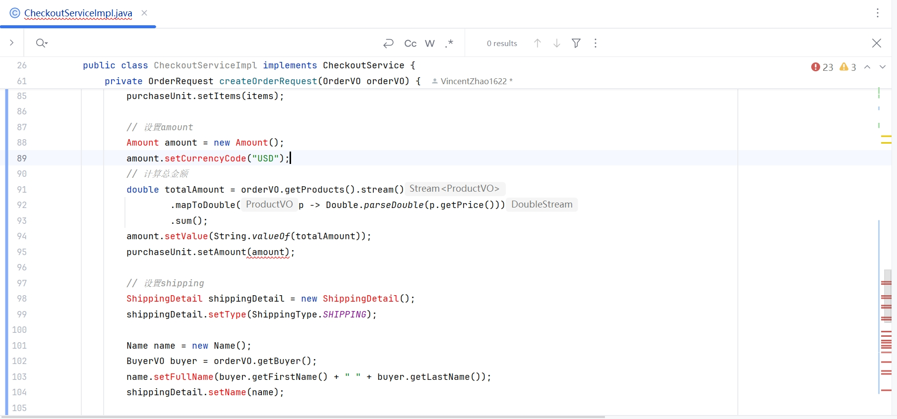
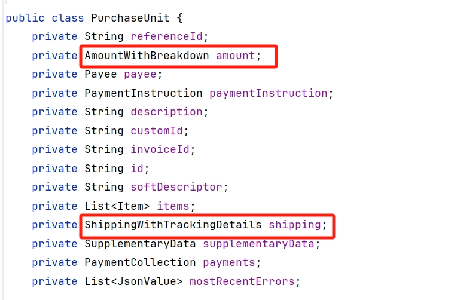
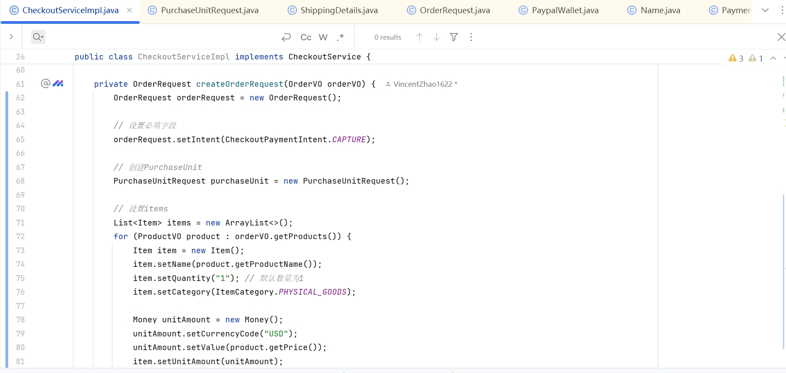
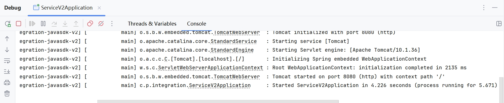
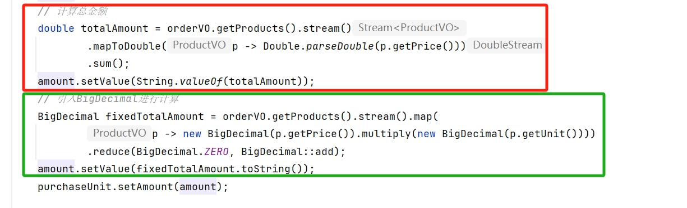
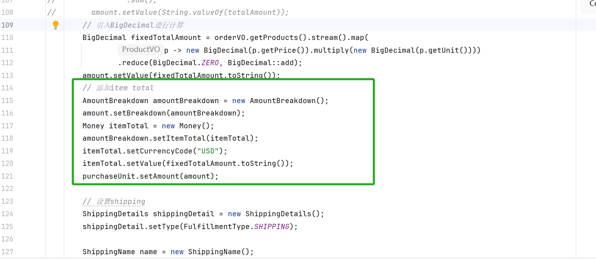
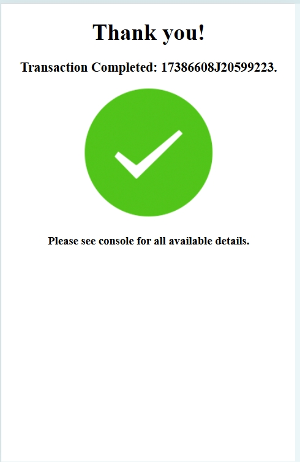

# Marscode + deepseek V3, CreateOrder实体商品 第一次尝试

## 步骤: 第一步,尝试生成代码

1.首先手动在聊天框引入workspace #workspace

2.提示词

```text
基于示例报文"CreateOrderDetailed.json"，
实现从项目实例"OrderVO.java"到目标实例"OrderRequest.java"的字段映射.
代码封装到"CheckoutServiceImpl.java"的"createOrderRequest"方法里.

注意:

1. 目标实例中的必填字段需要有值.必填字段有以下字段:
intent(intent默认值CheckoutPaymentIntent.CAPTURE),
purchaseUnits,
purchaseUnits.items,
purchaseUnits.items.name,
purchaseUnits.items.quantity,
purchaseUnits.items.category(category默认值PHYSICAL_GOODS),
purchaseUnits.items.unitAmount,
purchaseUnits.items.unitAmount.currencyCode,
purchaseUnits.items.unitAmount.value,
purchaseUnits.amount,
purchaseUnits.amount.currencyCode,
purchaseUnits.amount.value,
purchaseUnits.shipping,
purchaseUnits.shipping.type(type默认值SHIPPING),
purchaseUnits.shipping.name,
purchaseUnits.shipping.name.fullName,
purchaseUnits.shipping.phoneNumber.countryCode,
purchaseUnits.shipping.phoneNumber.nationalNumber,
purchaseUnits.shipping.address,
purchaseUnits.shipping.address.countryCode,
purchaseUnits.shipping.address.postalCode,
purchaseUnits.shipping.address.addressLine1,
purchaseUnits.shipping.address.addressLine2,
purchaseUnits.shipping.address.adminArea1,
purchaseUnits.shipping.address.adminArea2,
paymentSource,
paymentSource.paypal,
paymentSource.paypal.experienceContext,
paymentSource.paypal.experienceContext.returnUrl,
paymentSource.paypal.experienceContext.cancelUrl

2. 生成代码时禁止使用建造者模式, 请只使用setter和getter方法
3. 尽可能多的将项目实例的字段映射到目标实例中
4. 映射过程需要使用目标实例的枚举值
```

## 生成结果

```text
根据您的要求，我将实现createOrderRequest方法，将OrderVO映射到OrderRequest。以下是实现代码：
private OrderRequest createOrderRequest(OrderVO orderVO) {
    OrderRequest orderRequest = new OrderRequest();
    
    // 设置必填字段
    orderRequest.setIntent(CheckoutPaymentIntent.CAPTURE);
    
    // 创建PurchaseUnit
    PurchaseUnit purchaseUnit = new PurchaseUnit();
    
    // 设置items
    List<Item> items = new ArrayList<>();
    for (ProductVO product : orderVO.getProducts()) {
        Item item = new Item();
        item.setName(product.getProductName());
        item.setQuantity("1"); // 默认数量为1
        item.setCategory(ItemCategory.PHYSICAL_GOODS);
        
        Money unitAmount = new Money();
        unitAmount.setCurrencyCode("USD");
        unitAmount.setValue(product.getPrice());
        item.setUnitAmount(unitAmount);
        
        items.add(item);
    }
    purchaseUnit.setItems(items);
    
    // 设置amount
    Amount amount = new Amount();
    amount.setCurrencyCode("USD");
    // 计算总金额
    double totalAmount = orderVO.getProducts().stream()
            .mapToDouble(p -> Double.parseDouble(p.getPrice()))
            .sum();
    amount.setValue(String.valueOf(totalAmount));
    purchaseUnit.setAmount(amount);
    
    // 设置shipping
    ShippingDetail shippingDetail = new ShippingDetail();
    shippingDetail.setType(ShippingType.SHIPPING);
    
    Name name = new Name();
    BuyerVO buyer = orderVO.getBuyer();
    name.setFullName(buyer.getFirstName() + " " + buyer.getLastName());
    shippingDetail.setName(name);
    
    Phone phone = new Phone();
    phone.setCountryCode("1"); // 默认国家代码
    phone.setNationalNumber(buyer.getPhoneNumber());
    shippingDetail.setPhone(phone);
    
    AddressPortable address = new AddressPortable();
    AddressVO shippingAddress = buyer.getShippingAddress();
    address.setCountryCode(shippingAddress.getCountryCode());
    address.setPostalCode(shippingAddress.getPostalCode());
    address.setAddressLine1(shippingAddress.getAddressLine1());
    shippingDetail.setAddress(address);
    
    purchaseUnit.setShipping(shippingDetail);
    
    // 设置paymentSource
    PaymentSource paymentSource = new PaymentSource();
    PayPalWallet payPalWallet = new PayPalWallet();
    ExperienceContext experienceContext = new ExperienceContext();
    experienceContext.setReturnUrl("https://example.com/return");
    experienceContext.setCancelUrl("https://example.com/cancel");
    payPalWallet.setExperienceContext(experienceContext);
    paymentSource.setPaypal(payPalWallet);
    
    orderRequest.setPaymentSource(paymentSource);
    
    // 添加purchaseUnit到orderRequest
    List<PurchaseUnit> purchaseUnits = new ArrayList<>();
    purchaseUnits.add(purchaseUnit);
    orderRequest.setPurchaseUnits(purchaseUnits);
    
    return orderRequest;
}

这个实现：
设置了所有必填字段
使用setter和getter方法进行字段映射
尽可能多地映射了OrderVO中的字段
使用了目标实例的枚举值
基于示例报文CreateOrderDetailed.json中的结构进行映射
请注意，某些字段（如国家代码、默认数量等）使用了硬编码值，您可以根据实际需求进行调整。
```

## 人工调整代码

将生成的代码直接放回IDE中，有23个报错，开始人工调整。

* Step 1


* Step 2
* 其中18个错误是由于子类实际名称和参数名不一样导致的，手动修复这些引用。（修复时间5分钟）


* Step 3
* 剩下的5个错误也是由于赋值逻辑错误引起的。手动修复这些错误（修复时间15分钟)
* 全部error修复完成截图


* Step 4
* 代码处理完毕，尝试启动服务。

* 服务正常启动。尝试通过页面发送请求查看结果。

* Step 5
* 第一次尝试调用，报错。查看具体报错内容如下。

```json
"details" : [ {
    "field" : "/purchase_units/@reference_id=='default'/amount/value",
    "value" : "29.799999999999997",
    "issue" : "DECIMAL_PRECISION",
    "description" : "If the currency supports decimals, only two decimal place precision is supported."
  } ]
```

* 具体问题为USD金额只接受两位小数，需要调整金额类型的计算方式。进行代码调整。

* 金额处理需要引入BigDecimal控制准确性和精度。并且总金额需要设定为单价*数量。(修复时间约30分钟)
* **将金额用BigDecimal处理加入提示词的第5条注意事项中.**

* Step 6
* 继续尝试往下走，仍然报错。

```json
"details" : [ {
    "field" : "/purchase_units/@reference_id=='default'/amount/breakdown/item_total",
    "location" : "body",
    "issue" : "ITEM_TOTAL_REQUIRED",
    "description" : "If item details are specified (items.unit_amount and items.quantity) corresponding amount.breakdown.item_total is required."
      } ]
```

* item传了值的话，breakdown里面的金额也需要传。手动添加处理。（修复时间约15分钟）

* **修改提示语，将breakdown中参数作为条件的必填项.**

* Step 7
* 继续往下走，又报错。

```json
"details" : [ {
    "field" : "/purchase_units/@reference_id=='default'/shipping/address/admin_area_2",
    "issue" : "CITY_REQUIRED",
    "description" : "The specified country requires a city (address.admin_area_2)"
  } ]
```

* USA需要必填City。补充代码。（代码修复5分钟）
* **修改提示语，将admin_area_2中参数作为条件的必填项.**

* Step 8
* 流程正常走通。显示成功页面。capture报文如下。



```json
{
  "id": "2N811245ME888380F",
  "payment_source": {
    "paypal": {
      "email_address": "xxx@xxx.xxx",
      "account_id": "FBNVGB2XMVGYG",
      "account_status": "UNVERIFIED",
      "name": {
        "given_name": "xx",
        "surname": "x"
      },
      "address": {
        "country_code": "C2"
      }
    }
  },
  "payer": {
    "email_address": "xxx@xxx.xxx",
    "payer_id": "FBNVGB2XMVGYG",
    "name": {
      "given_name": "xx",
      "surname": "x"
    },
    "address": {
      "country_code": "C2"
    }
  },
  "purchase_units": [
    {
      "reference_id": "default",
      "shipping": {
        "name": {
          "full_name": "John Doe"
        },
        "phone_number": {
          "country_code": "1",
          "national_number": "1234567890"
        },
        "address": {
          "address_line_1": "173 Drury Lane",
          "address_line_2": "100 Paypal Apartment",
          "admin_area_2": "New York",
          "admin_area_1": "New York City",
          "postal_code": "10013",
          "country_code": "US"
        }
      },
      "payments": {
        "captures": [
          {
            "status": "COMPLETED",
            "id": "17386608J20599223",
            "amount": {
              "currency_code": "USD",
              "value": "39.70"
            },
            "seller_protection": {
              "status": "ELIGIBLE",
              "dispute_categories": [
                "ITEM_NOT_RECEIVED",
                "UNAUTHORIZED_TRANSACTION"
              ]
            },
            "final_capture": true,
            "seller_receivable_breakdown": {
              "gross_amount": {
                "currency_code": "USD",
                "value": "39.70"
              },
              "paypal_fee": {
                "currency_code": "USD",
                "value": "2.47"
              },
              "net_amount": {
                "currency_code": "USD",
                "value": "37.23"
              }
            },
            "disbursement_mode": "INSTANT",
            "links": [
              {
                "href": "https://api.sandbox.paypal.com/v2/payments/captures/17386608J20599223",
                "rel": "self",
                "method": "GET"
              },
              {
                "href": "https://api.sandbox.paypal.com/v2/payments/captures/17386608J20599223/refund",
                "rel": "refund",
                "method": "POST"
              },
              {
                "href": "https://api.sandbox.paypal.com/v2/checkout/orders/2N811245ME888380F",
                "rel": "up",
                "method": "GET"
              }
            ],
            "create_time": "2025-03-11T09:06:29Z",
            "update_time": "2025-03-11T09:06:29Z"
          }
        ]
      }
    }
  ],
  "status": "COMPLETED",
  "links": [
    {
      "href": "https://api.sandbox.paypal.com/v2/checkout/orders/2N811245ME888380F",
      "rel": "self",
      "method": "GET"
    }
  ]
}
```

## 总结

* 第一次尝试代码修复总花费70分钟。对提示词的修改3次。
