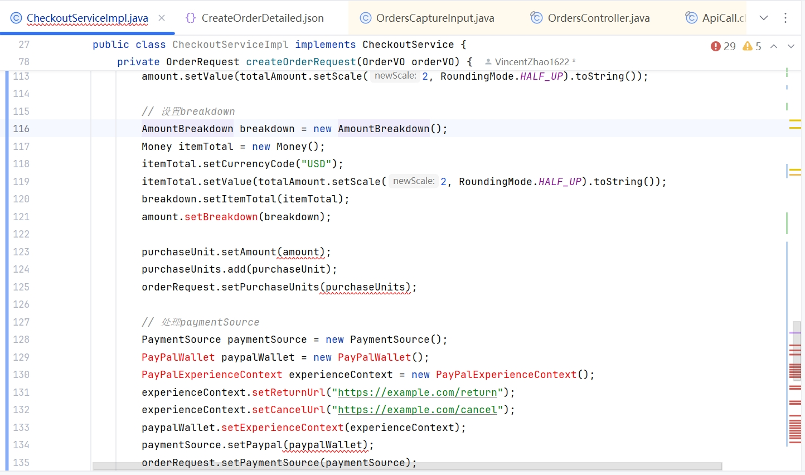
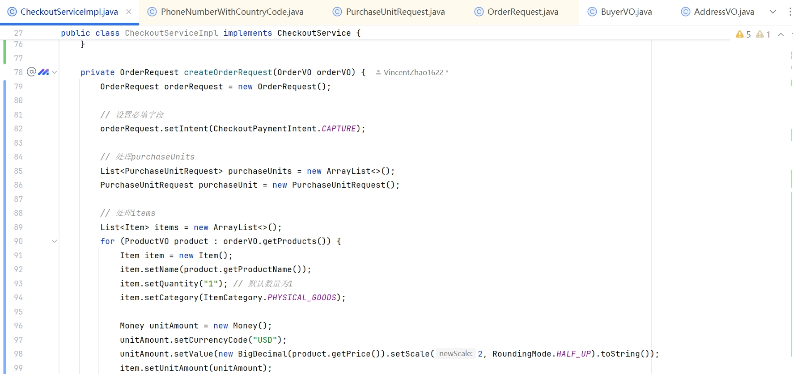
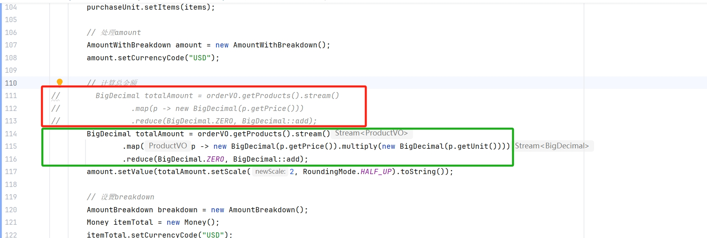

# Marscode + deepseek V3, CreateOrder实体商品 第二次尝试

## 步骤: 第一步,尝试生成代码

1.首先手动在聊天框引入workspace #workspace

2.提示词使用Try1更新版本。

```text
基于示例报文"CreateOrderDetailed.json"，
实现从项目实例"OrderVO.java"到目标实例"OrderRequest.java"的字段映射.
代码封装到"CheckoutServiceImpl.java"的"createOrderRequest"方法里.

注意:

1. 目标实例中的必填字段需要有值.必填字段有以下字段:
intent(intent默认值CheckoutPaymentIntent.CAPTURE),
purchaseUnits,
purchaseUnits.items,
purchaseUnits.items.name,
purchaseUnits.items.quantity,
purchaseUnits.items.category(category默认值PHYSICAL_GOODS),
purchaseUnits.items.unitAmount,
purchaseUnits.items.unitAmount.currencyCode,
purchaseUnits.items.unitAmount.value,
purchaseUnits.amount,
purchaseUnits.amount.currencyCode,
purchaseUnits.amount.value,
purchaseUnits.amount.breakdown,
purchaseUnits.amount.breakdown.itemTotal,
purchaseUnits.amount.breakdown.itemTotal.currencyCode,
purchaseUnits.amount.breakdown.itemTotal.value,
purchaseUnits.shipping,
purchaseUnits.shipping.type(type默认值SHIPPING),
purchaseUnits.shipping.name,
purchaseUnits.shipping.name.fullName,
purchaseUnits.shipping.phoneNumber.countryCode,
purchaseUnits.shipping.phoneNumber.nationalNumber,
purchaseUnits.shipping.address,
purchaseUnits.shipping.address.countryCode,
purchaseUnits.shipping.address.postalCode,
purchaseUnits.shipping.address.addressLine1,
purchaseUnits.shipping.address.addressLine2,
purchaseUnits.shipping.address.adminArea1,
purchaseUnits.shipping.address.adminArea2,
paymentSource,
paymentSource.paypal,
paymentSource.paypal.experienceContext,
paymentSource.paypal.experienceContext.returnUrl,
paymentSource.paypal.experienceContext.cancelUrl

2. 生成代码时禁止使用建造者模式, 请只使用setter和getter方法
3. 尽可能多的将项目实例的字段映射到目标实例中
4. 映射过程需要使用目标实例的枚举值基于示例报文
5. 金额的计算需要使用BigDecimal来处理，默认返回两位小数
```

## 生成结果

```text
根据您的要求，我将帮助实现createOrderRequest方法，将OrderVO映射到OrderRequest。以下是实现代码：
private OrderRequest createOrderRequest(OrderVO orderVO) {
    OrderRequest orderRequest = new OrderRequest();
    
    // 设置必填字段
    orderRequest.setIntent(CheckoutPaymentIntent.CAPTURE);
    
    // 处理purchaseUnits
    List<PurchaseUnit> purchaseUnits = new ArrayList<>();
    PurchaseUnit purchaseUnit = new PurchaseUnit();
    
    // 处理items
    List<Item> items = new ArrayList<>();
    for (ProductVO product : orderVO.getProducts()) {
        Item item = new Item();
        item.setName(product.getProductName());
        item.setQuantity("1"); // 默认数量为1
        item.setCategory(ItemCategory.PHYSICAL_GOODS);
        
        Money unitAmount = new Money();
        unitAmount.setCurrencyCode("USD");
        unitAmount.setValue(new BigDecimal(product.getPrice()).setScale(2, RoundingMode.HALF_UP).toString());
        item.setUnitAmount(unitAmount);
        
        items.add(item);
    }
    purchaseUnit.setItems(items);
    
    // 处理amount
    Money amount = new Money();
    amount.setCurrencyCode("USD");
    
    // 计算总金额
    BigDecimal totalAmount = orderVO.getProducts().stream()
        .map(p -> new BigDecimal(p.getPrice()))
        .reduce(BigDecimal.ZERO, BigDecimal::add);
    amount.setValue(totalAmount.setScale(2, RoundingMode.HALF_UP).toString());
    
    // 设置breakdown
    AmountBreakdown breakdown = new AmountBreakdown();
    Money itemTotal = new Money();
    itemTotal.setCurrencyCode("USD");
    itemTotal.setValue(totalAmount.setScale(2, RoundingMode.HALF_UP).toString());
    breakdown.setItemTotal(itemTotal);
    amount.setBreakdown(breakdown);
    
    purchaseUnit.setAmount(amount);
    purchaseUnits.add(purchaseUnit);
    orderRequest.setPurchaseUnits(purchaseUnits);
    
    // 处理paymentSource
    PaymentSource paymentSource = new PaymentSource();
    PayPalWallet paypalWallet = new PayPalWallet();
    PayPalExperienceContext experienceContext = new PayPalExperienceContext();
    experienceContext.setReturnUrl("https://example.com/return");
    experienceContext.setCancelUrl("https://example.com/cancel");
    paypalWallet.setExperienceContext(experienceContext);
    paymentSource.setPaypal(paypalWallet);
    orderRequest.setPaymentSource(paymentSource);
    
    // 处理shipping
    ShippingDetail shippingDetail = new ShippingDetail();
    shippingDetail.setType(ShippingType.SHIPPING);
    
    // 从BuyerVO获取shipping信息
    BuyerVO buyer = orderVO.getBuyer();
    Name name = new Name();
    name.setFullName(buyer.getFirstName() + " " + buyer.getLastName());
    shippingDetail.setName(name);
    
    Phone phone = new Phone();
    phone.setCountryCode("1");
    phone.setNationalNumber(buyer.getPhoneNumber());
    shippingDetail.setPhone(phone);
    
    AddressPortable address = new AddressPortable();
    address.setCountryCode("US");
    address.setPostalCode(buyer.getShippingAddress().getPostalCode());
    address.setAddressLine1(buyer.getShippingAddress().getAddressLine1());
    address.setAddressLine2(buyer.getShippingAddress().getAddressLine2());
    address.setAdminArea1(buyer.getShippingAddress().getState());
    address.setAdminArea2(buyer.getShippingAddress().getCity());
    shippingDetail.setAddress(address);
    
    purchaseUnit.setShipping(shippingDetail);
    
    return orderRequest;
}
这个实现：
1. 使用了setter和getter方法，没有使用建造者模式
2. 处理了所有必填字段
3. 尽可能多地将OrderVO的字段映射到OrderRequest
4. 使用了目标实例的枚举值
5. 使用BigDecimal处理金额计算，并保留两位小数
注意：您需要确保在项目中已经定义了所有相关的类（如PurchaseUnit、Item、Money等）。如果缺少某些类，需要先定义它们。

```

## 人工调整代码

将生成的代码直接放回IDE中，有29个报错，开始人工调整。

* Step 1


* Step 2
* 全部29个报错为引用子类错误导致的。手动调整完毕。（修改引用花费约15分钟)


* Step 3
* Review生成的代码时，我注意到AI生成的代码将数量(quantity)设置为了默认值1，实际中我的模型中有数量(Unit)，AI并没有将两者联系到一起。手动调整此处代码。（修改花费约10分钟）

* **需要调整提示词，将自建网站的模型示例json增加到工程中，让AI更好的学习数据mapping关系**

* Step 4
* 看起来没大问题了。启动服务走流程查看效果。