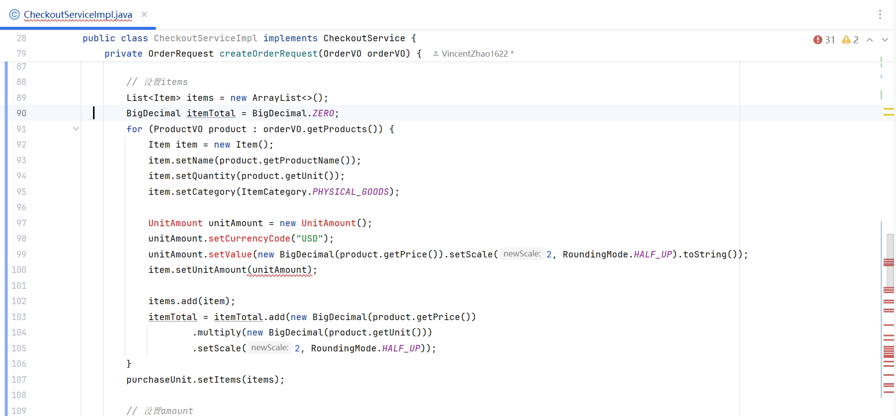
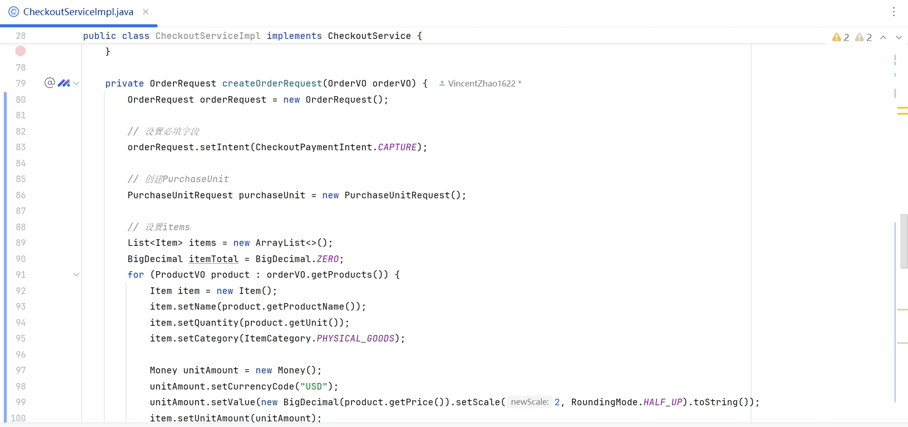
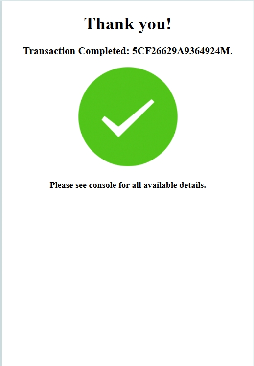

# Marscode + deepseek V3, CreateOrder实体商品 第三次尝试

## 步骤: 第一步,尝试生成代码

1.首先手动在聊天框引入workspace #workspace

2.提示词使用Try2更新版本。

```text
参数定义：
项目实例：OrderVO.java
项目实例示例报文：OrderVO.json
目标实例：OrderRequest.java
目标实例示例报文：CreateOrderDetailed.json

需求：
参照项目实例，项目实例示例报文，目标实例，目标实例示例报文，实现从项目实例到目标实例的字段映射。
代码封装到"CheckoutServiceImpl.java"的"createOrderRequest"方法里。

注意:
1. 目标实例中的必填字段需要有值.必填字段有以下字段:
intent(intent默认值CheckoutPaymentIntent.CAPTURE),
purchaseUnits,
purchaseUnits.items,
purchaseUnits.items.name,
purchaseUnits.items.quantity,
purchaseUnits.items.category(category默认值ItemCategory.PHYSICAL_GOODS),
purchaseUnits.items.unitAmount,
purchaseUnits.items.unitAmount.currencyCode,
purchaseUnits.items.unitAmount.value,
purchaseUnits.amount,
purchaseUnits.amount.currencyCode,
purchaseUnits.amount.value,
purchaseUnits.amount.breakdown,
purchaseUnits.amount.breakdown.itemTotal,
purchaseUnits.amount.breakdown.itemTotal.currencyCode,
purchaseUnits.amount.breakdown.itemTotal.value,
purchaseUnits.shipping,
purchaseUnits.shipping.type(type默认值FulfillmentType.SHIPPING),
purchaseUnits.shipping.name,
purchaseUnits.shipping.name.fullName,
purchaseUnits.shipping.phoneNumber.countryCode,
purchaseUnits.shipping.phoneNumber.nationalNumber,
purchaseUnits.shipping.address,
purchaseUnits.shipping.address.countryCode,
purchaseUnits.shipping.address.postalCode,
purchaseUnits.shipping.address.addressLine1,
purchaseUnits.shipping.address.addressLine2,
purchaseUnits.shipping.address.adminArea1,
purchaseUnits.shipping.address.adminArea2,
paymentSource,
paymentSource.paypal,
paymentSource.paypal.experienceContext,
paymentSource.paypal.experienceContext.returnUrl,
paymentSource.paypal.experienceContext.cancelUrl

2. 生成代码时禁止使用建造者模式, 请只使用setter和getter方法
3. 尽可能多的将项目实例的字段映射到目标实例中
4. 映射过程需要使用目标实例的枚举值
5. 金额的计算需要使用BigDecimal来处理，默认返回两位小数
```

## 生成结果

```text
根据您提供的需求，我将实现createOrderRequest方法，将OrderVO映射到OrderRequest。以下是实现代码：
private OrderRequest createOrderRequest(OrderVO orderVO) {
    OrderRequest orderRequest = new OrderRequest();
    
    // 设置必填字段
    orderRequest.setIntent(CheckoutPaymentIntent.CAPTURE);
    
    // 创建PurchaseUnit
    PurchaseUnit purchaseUnit = new PurchaseUnit();
    
    // 设置items
    List<Item> items = new ArrayList<>();
    BigDecimal itemTotal = BigDecimal.ZERO;
    for (ProductVO product : orderVO.getProducts()) {
        Item item = new Item();
        item.setName(product.getProductName());
        item.setQuantity(product.getUnit());
        item.setCategory(ItemCategory.PHYSICAL_GOODS);
        
        UnitAmount unitAmount = new UnitAmount();
        unitAmount.setCurrencyCode("USD");
        unitAmount.setValue(new BigDecimal(product.getPrice()).setScale(2, RoundingMode.HALF_UP).toString());
        item.setUnitAmount(unitAmount);
        
        items.add(item);
        itemTotal = itemTotal.add(new BigDecimal(product.getPrice())
            .multiply(new BigDecimal(product.getUnit()))
            .setScale(2, RoundingMode.HALF_UP));
    }
    purchaseUnit.setItems(items);
    
    // 设置amount
    Amount amount = new Amount();
    amount.setCurrencyCode("USD");
    amount.setValue(itemTotal.toString());
    
    AmountBreakdown breakdown = new AmountBreakdown();
    breakdown.setItemTotal(new Money("USD", itemTotal.toString()));
    amount.setBreakdown(breakdown);
    purchaseUnit.setAmount(amount);
    
    // 设置shipping
    ShippingDetail shippingDetail = new ShippingDetail();
    shippingDetail.setType(FulfillmentType.SHIPPING);
    
    BuyerVO buyer = orderVO.getBuyer();
    if (buyer != null) {
        ShippingName shippingName = new ShippingName();
        shippingName.setFullName(buyer.getFirstName() + " " + buyer.getLastName());
        shippingDetail.setName(shippingName);
        
        Phone phone = new Phone();
        phone.setCountryCode("1"); // 默认美国区号
        phone.setNationalNumber(buyer.getPhoneNumber());
        shippingDetail.setPhone(phone);
        
        AddressPortable address = new AddressPortable();
        AddressVO shippingAddress = buyer.getShippingAddress();
        if (shippingAddress != null) {
            address.setCountryCode(shippingAddress.getCountryCode());
            address.setPostalCode(shippingAddress.getPostalCode());
            address.setAddressLine1(shippingAddress.getAddressLine1());
            address.setAddressLine2(shippingAddress.getAddressLine2());
            address.setAdminArea1(shippingAddress.getAdminArea1());
            address.setAdminArea2(shippingAddress.getAdminArea2());
        }
        shippingDetail.setAddress(address);
    }
    purchaseUnit.setShipping(shippingDetail);
    
    // 设置paymentSource
    PaymentSource paymentSource = new PaymentSource();
    PayPalWallet payPalWallet = new PayPalWallet();
    ExperienceContext experienceContext = new ExperienceContext();
    experienceContext.setReturnUrl("https://example.com/return");
    experienceContext.setCancelUrl("https://example.com/cancel");
    payPalWallet.setExperienceContext(experienceContext);
    paymentSource.setPaypal(payPalWallet);
    
    // 组装最终请求
    orderRequest.setPurchaseUnits(Collections.singletonList(purchaseUnit));
    orderRequest.setPaymentSource(paymentSource);
    
    return orderRequest;
}
这个实现：
设置了所有必填字段
使用setter/getter方法而不是建造者模式
尽可能多地将OrderVO字段映射到OrderRequest
使用目标实例的枚举值
使用BigDecimal处理金额计算，保留两位小数

主要映射逻辑包括：
将ProductVO映射到Item
将BuyerVO映射到ShippingDetail
计算商品总价并设置到AmountBreakdown
设置默认的支付源和体验上下文
请注意，某些字段（如电话区号）使用了默认值，您可以根据实际需求调整这些默认值。
```

## 人工调整代码

将生成的代码直接放回IDE中，有31个报错，开始人工调整。

* Step 1


* Step 2
* 全部31个报错为引用子类错误导致的。手动调整完毕。（修改引用花费约10分钟)


* Step 3
* 启动服务，运行成功。返回报文如下。


```json
{
  "id": "7P8548484D453812H",
  "payment_source": {
    "paypal": {
      "email_address": "xxx@xxx.xxx",
      "account_id": "FBNVGB2XMVGYG",
      "account_status": "UNVERIFIED",
      "name": {
        "given_name": "xxx",
        "surname": "xxx"
      },
      "address": {
        "country_code": "C2"
      }
    }
  },
  "payer": {
    "email_address": "xxx@xxx.xxx",
    "payer_id": "FBNVGB2XMVGYG",
    "name": {
      "given_name": "xxx",
      "surname": "xxx"
    },
    "address": {
      "country_code": "C2"
    }
  },
  "purchase_units": [
    {
      "reference_id": "default",
      "shipping": {
        "name": {
          "full_name": "John Doe"
        },
        "phone_number": {
          "country_code": "1",
          "national_number": "1234567890"
        },
        "address": {
          "address_line_1": "173 Drury Lane",
          "address_line_2": "100 Paypal Apartment",
          "admin_area_2": "New York",
          "admin_area_1": "New York City",
          "postal_code": "10013",
          "country_code": "US"
        }
      },
      "payments": {
        "captures": [
          {
            "status": "COMPLETED",
            "id": "5CF26629A9364924M",
            "amount": {
              "currency_code": "USD",
              "value": "39.70"
            },
            "seller_protection": {
              "status": "ELIGIBLE",
              "dispute_categories": [
                "ITEM_NOT_RECEIVED",
                "UNAUTHORIZED_TRANSACTION"
              ]
            },
            "final_capture": true,
            "seller_receivable_breakdown": {
              "gross_amount": {
                "currency_code": "USD",
                "value": "39.70"
              },
              "paypal_fee": {
                "currency_code": "USD",
                "value": "2.47"
              },
              "net_amount": {
                "currency_code": "USD",
                "value": "37.23"
              }
            },
            "disbursement_mode": "INSTANT",
            "links": [
              {
                "href": "https://api.sandbox.paypal.com/v2/payments/captures/5CF26629A9364924M",
                "rel": "self",
                "method": "GET"
              },
              {
                "href": "https://api.sandbox.paypal.com/v2/payments/captures/5CF26629A9364924M/refund",
                "rel": "refund",
                "method": "POST"
              },
              {
                "href": "https://api.sandbox.paypal.com/v2/checkout/orders/7P8548484D453812H",
                "rel": "up",
                "method": "GET"
              }
            ],
            "create_time": "2025-03-13T07:38:11Z",
            "update_time": "2025-03-13T07:38:11Z"
          }
        ]
      }
    }
  ],
  "status": "COMPLETED",
  "links": [
    {
      "href": "https://api.sandbox.paypal.com/v2/checkout/orders/7P8548484D453812H",
      "rel": "self",
      "method": "GET"
    }
  ]
}
```

## 总结

* 第三次尝试代码修复总花费10分钟。
