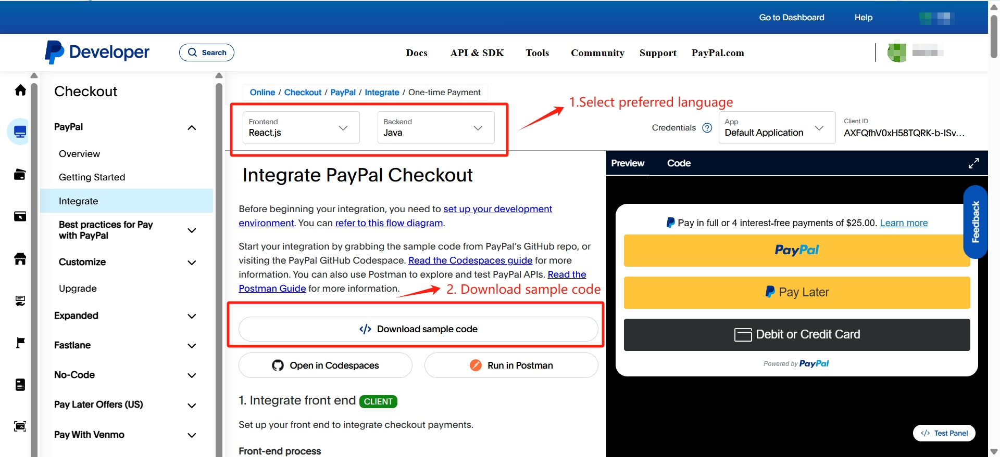

# 使用AI编程工具对接PP API调查

## 1. 目的

* 通过市场上的AI编程工具，结合PayPal为开发者提供的对接文档/工具/Sample代码等，能够使商户加速完成技术对接。

## 2. AI编程工具调查

* 目前调查市场上AI编程工具有如下几类。
  
  | Vendor Category | Tools           | Highlights                            |
  | --------------- | --------------- | ------------------------------------- |
  | Independent vendors | Github Copilot, Continue.dev, Cursor AI | 独立厂商，可接入大部分主流LLM |
  | Global 1st Party vendors | ChatGPT Coding assistant, Claude Code, Gemini Code Assistant | 一方厂商，对自家的LLM兼容好 |
  | China 1st Party vendors | DeepSeek coder, MarsCode, TraeAI, Qwen | 国内一方厂商，提供中文论坛支持，方便国内技术人员使用 |

## 3. 调查方案

* 目前设定3个use cases,
    1. Auto-generate CreateOrder API mappings (自动生成CreateOrder API的代码转换逻辑)。
    2. Auto-complete coding with PayPal sample codes（基于PayPal的sample代码，自动补全代码）
    3. Auto-testing with PayPal sample requests （自动生成测试代码）

## 4. 对接准备

### 4.1 PayPal端代码准备

* PayPal对接建议从如下链接地址开始。在PayPal官网注册登录以后，可以从这个页面下载对应编程语言对应的示例代码，可以选择对应的前端和后端语言。（此处以Standard Checkout为例）
  * <https://developer.paypal.com/studio/checkout/standard/integrate>
    

  * 本次调查专注于后端的字段映射。使用Java作为示例原因主要为在国内环境下Java作为后端代码比较普遍。后续会再基于其他语言（Python, Nodejs等）进行调查。

  * 下载的代码结构如下，重要点主要有两部分：
      
    1. 通过PayPal SDK创建的paypalClient，传入ClientID和ClientSecret即可创建和PayPal服务端的连接。（注意需要手动更新sdk的最新版本）

    2. 通过CheckoutController暴露了两个API， CreateOrder（创建订单）和CaptureOrder（确认收款）。这两个API是使用PayPal服务的基础，几乎所有对接都需要实现这两个API。

### 4.2 商户端代码准备

* 商户对接PayPal基本都是通过自建站，拥有自己的数据结构，主要包括个人信息，商品信息，地址信息等。此处模拟用户网站预设置好这些信息。
* 购物车示例如下。（模拟前端已按照示例代码完成对接）

### 4.3 示例请求报文准备

* 参照PayPal官方提供的所有API报文集合。
* <https://www.postman.com/paypal/paypal-public-api-workspace/overview>

* 本次调查使用报文"200 - Create Order With Detailed Request - PayPal".

## 5. 方案调查详细

### 5.1 Auto-generate CreateOrder API mappings(自动生成CreateOrder API的代码转换逻辑)

  * MarsCode调查详细:  [MarsCode调查详细.md](./MarsCode/README.md)
  * Copilot调查详细： [Copilot调查详细.md](./Copilot/README.md)
